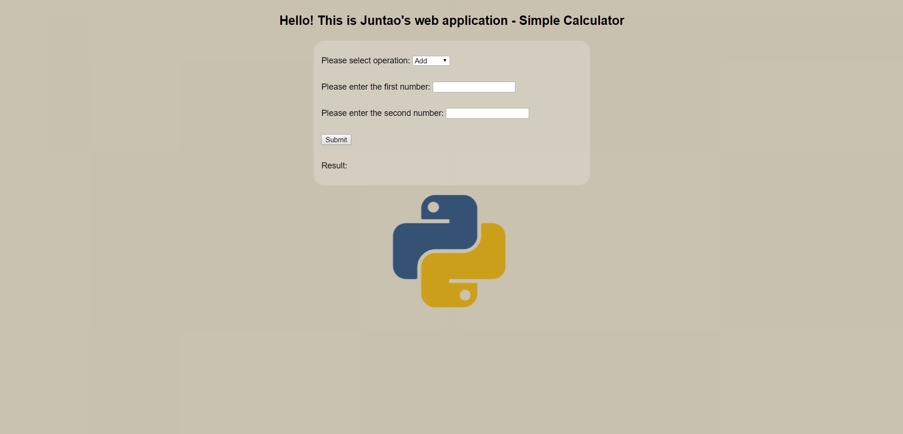

# HW1 - Using Apache WSGI Module and Flask to Construct a Simple Calculator 
Juntao Dong M10453134

### Introduction
The web application developed in this assignment is a simple calculator. It's a Python Flask application running under the Apache WSGI module. It can do basic calculation and return the result. 

The layout of the calculator is written in html language. The website contains a html form which includes four inputs: mathmatical operation(add, substrate, multiply, divide), first number, second number and a submit button. The step of the input number is 0.0001 which means one can only input number with limited accuracy. Once you enter all the inputs and click submit button, the result will show below as expected.

### Workflow
* Launch a AWS EC2 instance. Choose Amazon Linux AMI. Configure security group with SSH, Custom TCP (port=5000) and HTTP (port=80).
* Connect the EC2 instance with PuTTY and WinSCP.

* Install and configure Flask, Apache(httpd), and WSGI module.
* Under route: /var/www, construct the web-application. The structure shows below:
>flaskapp

>>calculator.py

>>calculator.wsgi

>>static

>>>finalstyle.css

>>>images

>>>>background.png

>>templates

>>>index.html
* Under route: /etc/httpd/conf.d, add vhost.conf to finalize the Apache config.
* Open browser and visit the public URL that EC2 instance offered, test the web-application and make improvements.

### Details on configuring Apache and WSGI
* Install Apache and WSGI module
```
sudo yum install httpd
sudo yum install mod24_wsgi-python27.x86_64
```
* Prepare WSGI file
>Create .wsgi file and put it together with the python program for convinience.
* Configure Apache
>* Start Apache web server
 ```
 sudo service httpd start
 ```
>* Use the chkconfig command to configure the Apache web server to start at each system boot
 ```
 sudo chkconfig httpd on
 ```
>* Edit virtual host file
 ```
 sudo vi /etc/httpd/conf.d/vhost.conf
 ```

### Enable HTTPS
* Start Apache web server
* Add SSL/TLS support by installing the Apache module mod_ssl
```
sudo yum install -y mod24_ssl
```
* Restart Apache
* Create a CSR using localhost.key under path /etc/pki/tls/private/
>

The generated CSR
* Submit the CSR to a certification agency to get a certificate
>I haven't submitted my CSR to a CA since there are tons of websites offer this service. It seems that the following part is understandable so I stopped at this point. In my leisure time I may finish enabling HTTPS to my web-application.

### Reference
https://github.uc.edu/tatavag/Cloud_Computing_2018

http://flask.pocoo.org/

https://www.fullstackpython.com/wsgi-servers.html

http://opentechschool.github.io/python-flask/

https://developer.mozilla.org/en-US/docs/Web/HTML/Element

https://docs.aws.amazon.com/AWSEC2/latest/UserGuide/install-LAMP.html

https://www.taniarascia.com/getting-started-with-aws-setting-up-a-virtual-server/

http://peatiscoding.me/geek-stuff/mod_wsgi-apache-virtualenv/

https://www.jakowicz.com/flask-apache-wsgi/

https://docs.aws.amazon.com/AWSEC2/latest/UserGuide/SSL-on-an-instance.html
