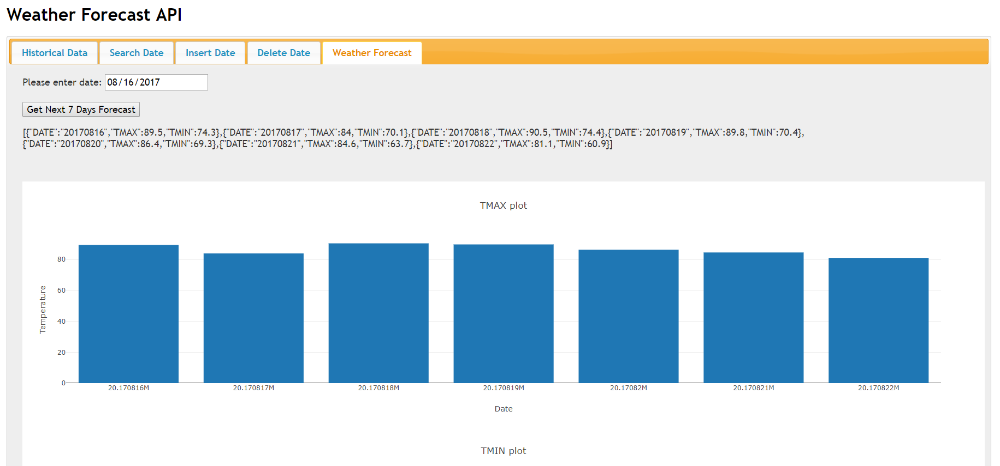

# HW2 - RESTFUL WEB SERVICES

### Juntao Dong



In this weather information web service, the main packages used in Python are flask, flask_restful, and sqlalchemy. Sqlite is selected as the backend database system. Finally, five end points are created to update the backend database via CRUD method:

* **/historical/**: Using GET method to return a json list of all dates for which weather information is available. The information is transfered from daily.csv to then stored in sqlite database, daily.db. The data types of the parameters are: DATE string, TMAX double, TMIN double.

* **/historical/[dateYYYYMMDD]/**: Using GET method to return weather information for a particular date. If no information is available - 404 error.
  
* **/historical/**: Using POST method to add weather information for a particular day.

* **/historical/**: Using DELETE method to delete weathere infomation for a particular day.

* **/forecast/[dateYYYYMMDD]/**: Using GET method to generate weather forecast for next 7 days - the date could be an existing date of future date.

**Note: The weather data is between ```2013/01/01``` and ```2018/02/15``` so please make sure make quires between the dates to view the results.** 
 
#### Reference
http://www.drdobbs.com/web-development/restful-web-services-a-tutorial/240169069

https://blog.miguelgrinberg.com/post/designing-a-restful-api-with-python-and-flask

https://codehandbook.org/flask-restful-api-using-python-mysql/ 

https://flask-restful.readthedocs.io/en/latest/quickstart.html#full-example

https://medium.com/python-pandemonium/build-simple-restful-api-with-python-and-flask-part-2-724ebf04d12

https://impythonist.wordpress.com/2015/07/12/build-an-api-under-30-lines-of-code-with-python-and-flask/
