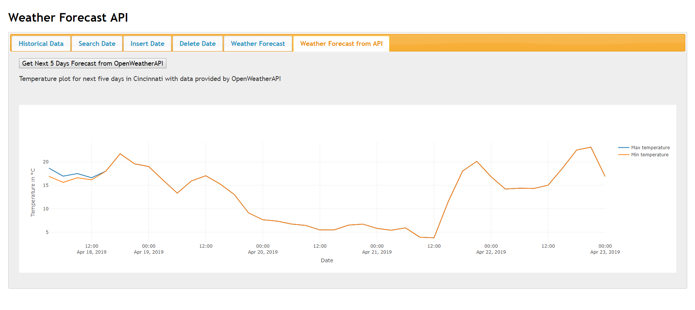

# HW3 - Upgrade UI to Dynamic Using Service API

In this homework assignment, I've implemented an UI for HW2 with a dynamic approach that uses asynchronous JavaScript requests to send the user-inputted data to the REST API I built, receive the structured results, and then publish them into the page without refreshing the whole page again.

### Javascript libraries used:
* jquery.js
* plotly.js
* jquery-ui.js

### API functions:
There are six tabs in this website including Historical Data, Search Date, Insert Data, Delete Data, Weather Forecast, and Weather Forecast from API.
* Historical Data

Once "View History" button is clicked, the api will withdraw all the weather history stored in the database.
* Search Date

Insert a date and click "Get Details" button, the api will retrieve the weather information of the day.
* Insert Data 

Insert a date and associated max and min temperature by clicking "Submit Data" button.
* Delete Data 

Insert a date and click "Complete Deletion" button, the api will remove the weather information of the day.
* Weather Forecast 

Insert a date and click "Get Next 7 Days Forecast" button, the api will plot the min and max temperature of next seven days.
* Weather Forecast from API

Extract real-time weather forecast information of Cincinnati from Open Weather Map. Once the button under the tab is clicked, the api will plot the temperature information of next five days.
