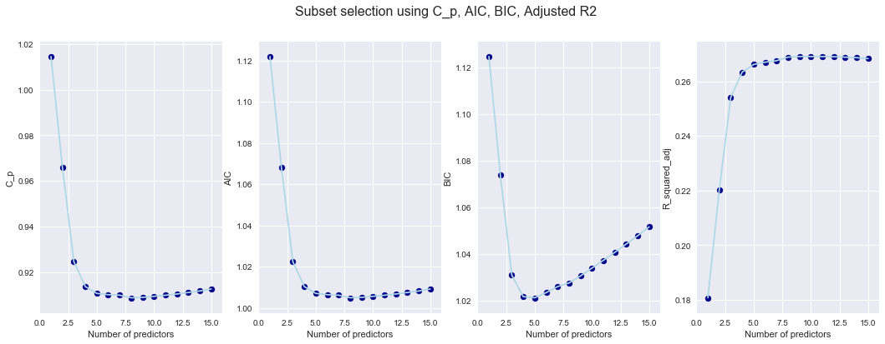
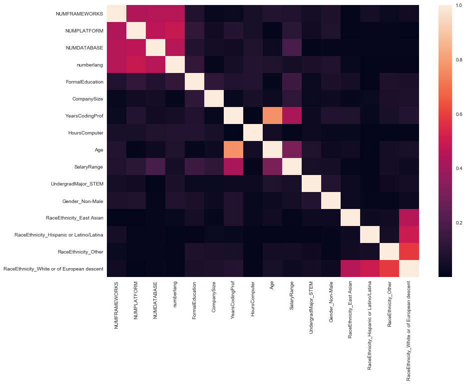

# Data Science Job Salary Prediction

This project was to review data submitted by developers from all over the world in 2018 to the published salary survey (https://insights.stackoverflow.com/survey/2018/#overview)  on their experience and salary to see if we could determine a valid model to predict anticipated salary for an individual with a given number of years of experience and the specific skill set.

We found that the survey provided much data to choose from but finding the correlations and items that directly impacted salary were much more difficult than anticipated.  The sample of data also provided challenges as much data required either exclusion or remapping.  Over 100,000 individuals submitted responses, but we narrowed the data set down to only US developers.  Our final conclusions were that we could not adequately predict salary for a given individual based upon their experience and skill set due to the lack of the geographical data.

## What kind of data set are you using

We are using data from Stack Overflow from their 2018 survey asking the developer community about everything from their favorite technologies to their job preferences. We will be exploring the responses from developers in the data analysis and data science areas.  Over 100,000 developers took the 30-minute survey in January 2018.

## How many variables

We will be using a subset of 12 fields from the original 129 possible variables. We only chose developers from the US. There were 184 countries represented in the original survey responses.  Our final sample has approximately 2500 respondents/responses.

## What is the response variable

We are choosing Converted Salary (annualized salary in USD) as the response variable.  We limited salary ranges from $20,000 USD to $250,000 USD as that is more reflective of industry reporting.  We will be evaluating the following for our covariants:

+ Education
+ Major
+ DevType (filtered for our criteria)
+ Years professional coding
+ Job Satisfaction? (We might put this as a response variable)
+ Languages
+ Platform/Framework
+ Daily hours on computer
+ Gender
+ Age
+ Race/Ethnicity
+ Company Size

From the above fields, we consolidated values (grouped) for Gender, Age, Race/Ethnicity, Company Size, YearsCodingProf, and HoursComputer to reduce the number of possible values and make them numeric where possible.  

For Languages, Platforms and Frameworks, we broke out into separate fields the various values with a 0/1 to indicate experience in that specific item. The final columns we will be evaluating include:

+ FormalEducation
+ UndergradMajor
+ CompanySize
+ YearsCodingProf
+ JobSatisfaction
+ ConvertedSalary
+ HoursComputer
+ Gender
+ RaceEthnicity
+ Age
+ Python
+ Scala
+ Matlab
+ SQL
+ Julia
+ Java
+ Salesforce
+ IBM Cloud or Watson
+ AWS
+ Azure
+ Google Cloud Platform App Engine
+ TensorFlow
+ Torch.PyTorch
+ Spark
+ Hadoop
+ R

Please check out the project details in the [final report pdf](https://github.com/JuntaoDong/DataSciencePortfolio/blob/master/Data%20Analysis%20Methods/Final%20project/Final%20report%20Dong%20Frankenhoff.pdf).