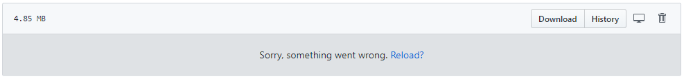

# My Data Science Portfolio

Welcome to my awesome data science project portfolio! I'm keeping uploading my latest data science projects.

If you can't open ipynb (Jupyter notebook) files in the repo and encounter an issue like below, please copy the url of the notebook to https://nbviewer.jupyter.org/

## M.S. Thesis Project (Ongoing)

### Time Series Vector Prediction Using Vector Autoregression (VAR) and Reinforcement Learning

Design and develop a trading system that automatically trades in the foreign exchange market to profit from fluctuations with VAR enabled reinforcement learning.

This is my ongoing M.S. thesis project, sorry that I cannot post the details right now. I'll definitely share the source code and idea after graduation.

## Data Science and Engineering Projects

+ [Computer Vision for Sports Advertising](https://github.com/JuntaoDong/DataSciencePortfolio/tree/master/IBM%20PowerAI%20Vision)
+ [Cloud Data Warehousing Using AWS](https://github.com/JuntaoDong/DataSciencePortfolio/tree/master/Udacity%20Data%20Engineer%20Nanodegree/Project%20-%20Data%20Warehouse)
+ [Postgres ETL](https://github.com/JuntaoDong/DataSciencePortfolio/tree/master/Udacity%20Data%20Engineer%20Nanodegree/Project%20-%20Data%20Modeling%20with%20Postgres)
+ [Cassandra ETL](https://github.com/JuntaoDong/DataSciencePortfolio/tree/master/Udacity%20Data%20Engineer%20Nanodegree/Project%20-%20Data%20Modeling%20with%20Cassandra)
+ [StackOverflow 2018 Survay Analysis](https://github.com/JuntaoDong/DataSciencePortfolio/tree/master/Data%20Analysis%20Methods/Final%20project)
+ [Restful API Deployment Using AWS and Docker](https://github.com/JuntaoDong/DataSciencePortfolio/tree/master/Cloud%20Computing/Project1)
+ [Big Data Analysis Using MapReduce / Apache Spark](https://github.com/JuntaoDong/DataSciencePortfolio/tree/master/Cloud%20Computing/Project2)

## Hackathons

+ [MakeUC 2019 - Rentool: A peer-to-per tool rental website]() Coming soon......
+ [Revolution UC 2019 - Augmented Reality (AR) Inventory Management System](https://github.com/JuntaoDong/RevolutionUC_2019)
+ [School of AI HealthHack 2019 - Respiratory Rate Algorithms](https://github.com/JuntaoDong/HealthHack2019)

## Data Science Courses

+ [UC-CS6065 Cloud Computing](https://github.com/JuntaoDong/DataSciencePortfolio/tree/master/Cloud%20Computing)
+ [UC-CS6073 Deep Learning](https://github.com/JuntaoDong/Deep_Learning_Assignments)
+ [UC-BANA7038 Data Analysis Methods](https://github.com/JuntaoDong/DataSciencePortfolio/tree/master/Data%20Analysis%20Methods)
+ [IBM Data Science Professional Certificate](https://github.com/JuntaoDong/DataSciencePortfolio/tree/master/IBM%20Data%20Science%20Professional%20Certificate)
+ [Udacity Data Engineer Nanodegree](https://github.com/JuntaoDong/DataSciencePortfolio/tree/master/Udacity%20Data%20Engineer%20Nanodegree)

## Data Visualization Projects

+ [Cincinnati Crime Dashboard](https://public.tableau.com/profile/jtdong#!/vizhome/CincinnatiPoliceDepartmentCrimeDashboard_0/CincinnatiCrimeStatisticsDashboard)
+ [Nike Manufacturing Map](https://public.tableau.com/profile/jtdong#!/vizhome/NikeManufacturingMap_2/TheNIKEManufacturingMap)
